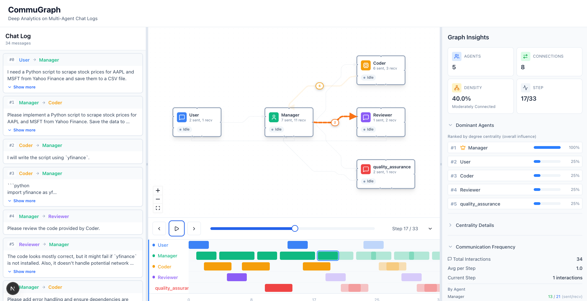
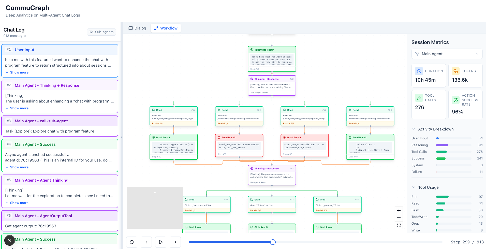
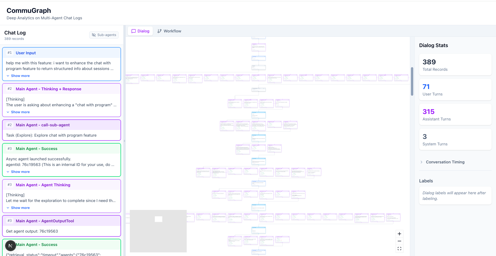

# CommuGraph

**Interactive visualizations for multi-agent chat logs**

Turn AutoGen and Claude Code conversation traces into temporal graphs you can explore, replay, and analyze.

## Views

### Graph View (AutoGen)

*Agent network with temporal "ghost trail" edges — current interactions highlighted, history fades*

### Workflow View (Claude Code)

*Tree layout showing tool calls, sub-agents, and execution flow*

### Dialog View (Claude Code)

*Sequential conversation flow for turn-by-turn analysis*

## Quick Start

```bash
git clone https://github.com/CH-chuan/CommuGraph.git
cd CommuGraph
npm install
npm run dev
```

Open [http://localhost:3000](http://localhost:3000)

## Supported Formats

| Framework | File Type | Notes |
|-----------|-----------|-------|
| AutoGen | `.jsonl` / `.json` | Single file with `sender`, `recipient`, `message`, `timestamp` |
| Claude Code | `.jsonl` | v2.0.64+ logs, supports sub-agent files |

## Features

- **Temporal playback** — Step through interactions with timeline controls
- **Ghost trail edges** — Current/recent/history states with visual fade
- **Cross-view highlighting** — Click chat message to highlight graph node
- **Sub-agent exploration** — Expand nested agent sessions
- **Session metrics** — Density, centrality, communication patterns

---

<details>
<summary><strong>Schema Details</strong></summary>

### AutoGen Schema

JSONL format where each line is one message:

```json
{"sender": "User", "recipient": "Manager", "message": "...", "timestamp": 1234567890}
```

Required fields: `sender`, `recipient`, `message`, `timestamp`

### Claude Code Logs

Tested against v2.0.64. Features:
- Topological ordering via UUID parent-child chain
- Phantom branch pruning (handles duplicate user messages)
- Context compaction tracking

</details>

<details>
<summary><strong>API Reference</strong></summary>

| Endpoint | Method | Description |
|----------|--------|-------------|
| `/api/upload` | POST | Upload log file |
| `/api/frameworks` | GET | List supported parsers |
| `/api/sessions` | GET | List all sessions |
| `/api/graph/[id]` | GET | Get graph snapshot (`?step=N` for time slice) |
| `/api/graph/[id]/metrics` | GET | Get graph metrics |
| `/api/graph/[id]/info` | GET | Get session info |
| `/api/graph/[id]/annotations` | GET | Get annotation records |
| `/api/graph/[id]/workflow` | GET | Get workflow data |
| `/api/session/[id]` | DELETE | Delete session |

</details>

<details>
<summary><strong>Architecture</strong></summary>

Unified **Next.js 15** monolith — all frontend and backend in TypeScript.

```
src/
├── app/           # App Router + API Routes
├── components/    # React components (graph, workflow, chat, ui)
├── lib/           # Parsers, services, graph algorithms
├── hooks/         # Data fetching, timeline playback
├── context/       # Global UI state
└── types/         # TypeScript definitions
```

**Core concept**: Time-aware edges store `Interaction` objects with timestamps and step indices, enabling temporal playback and pattern detection.

</details>

<details>
<summary><strong>Tech Stack</strong></summary>

| Component | Technology |
|-----------|------------|
| Framework | Next.js 15 (App Router) |
| Language | TypeScript |
| Graph Visualization | React Flow (@xyflow/react) |
| State Management | TanStack Query + React Context |
| Validation | Zod |
| Styling | Tailwind CSS |
| UI Components | shadcn/ui |

</details>

## Contributing

```bash
npm run lint       # ESLint
npm run build      # Type checking
```

## License

MIT
